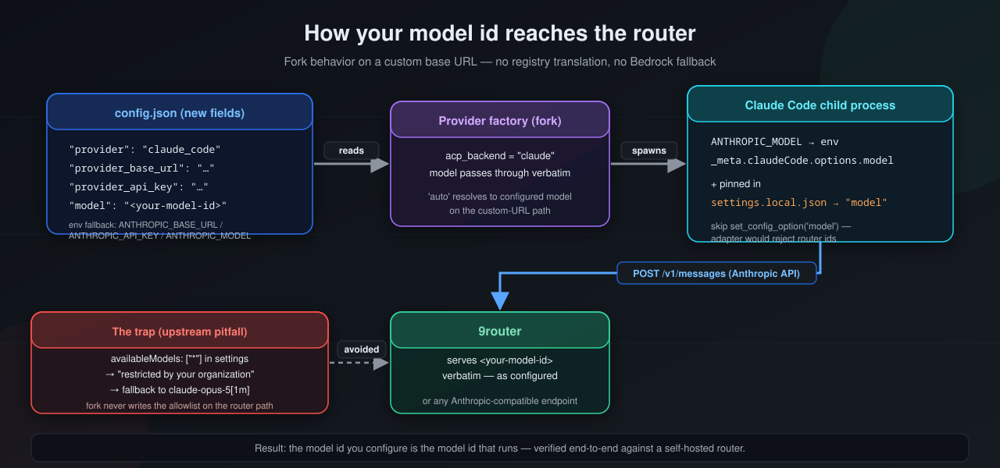

<p align="center">
  
</p>

<h1 align="center">kirocrew-customapi</h1>

<p align="center">
  <strong>Kiro Crew — with the Claude Code ACP backend re-enabled for self-hosted LLM routers.</strong>
</p>

<p align="center">
  This fork of <a href="https://github.com/kirodotdev/KiroCrew">kirodotdev/KiroCrew</a> re-activates the
  dormant <code>claude_code</code> provider (the <code>ACP_BACKEND_CLAUDE</code> seam) so you can drive
  Kiro Crew through <strong>your own model router</strong> — e.g. a local
  <a href="https://github.com/decolua/9router">9router</a> instance speaking the Anthropic API — instead of
  Kiro's built-in Bedrock catalog.
</p>

<p align="center">
  <a href="#why"><strong>Why</strong></a> ·
  <a href="#how-it-works"><strong>How it works</strong></a> ·
  <a href="#installation"><strong>Installation</strong></a> ·
  <a href="#configuration"><strong>Configuration</strong></a> ·
  <a href="#tutorial-connect-your-own-model"><strong>Tutorial: plug in your own models</strong></a> ·
  <a href="#troubleshooting"><strong>Troubleshooting</strong></a> ·
  <a href="#upstream"><strong>Upstream</strong></a>
</p>

<p align="center">
  <strong>Download the desktop app</strong> — every release ships Linux, macOS, and Windows builds.
</p>

<p align="center">
  <a href="https://github.com/encomjp/kirocrew-customapi/releases/latest/download/KiroCrew-0.2.0.AppImage">
    
  </a>
  <a href="https://github.com/encomjp/kirocrew-customapi/releases/latest/download/KiroCrew-0.2.0-arm64.dmg">
    
  </a>
  <a href="https://github.com/encomjp/kirocrew-customapi/releases/latest/download/KiroCrew.Setup.0.2.0.exe">
    
  </a>
</p>

<p align="center">
  <a href="https://github.com/encomjp/kirocrew-customapi/releases/latest">
    <strong>All assets &amp; older versions →</strong>
  </a>
</p>

---

## Why

Kiro Crew's public build hard-caps `agent.provider` to `"acp"` (the kiro-cli backend), and model selection
goes through Kiro's own AWS Bedrock catalog — you must log in with a Kiro account and your agent traffic
leaves your network. The underlying code for a Claude Code backend (`ACP_BACKEND_CLAUDE`, `_is_claude`,
`claude-agent-acp` protocol support) has always existed but was deliberately left dormant, with comments
reserving it for "an internal companion".

This fork re-adds the missing glue:

- `agent.provider` accepts **`claude_code`** in addition to `acp`
- new config fields **`agent.provider_base_url`** and **`agent.provider_api_key`**
- the provider factory spawns **claude-agent-acp** (which drives the real Claude Code CLI) pointed at your
  base URL, with the model id passed through unchanged (router namespaces are not registry-translated)
- `settings.local.json` seeding so Claude Code honors the router model (see Troubleshooting for the
  `availableModels` pitfall)
- `kirocrew doctor` reports claude-acp as the active backend when configured

Everything else — desktop app, dashboard, cron, memory, skills, subagents, apps — is untouched upstream
Kiro Crew.

## How it works

<p align="center">
   claude-agent-acp -> Claude Code -> 9router" width="900">
</p>

- **Kiro Crew** (this fork) acts as the harness: sessions, tool permissions, memory, cron, dashboard.
- **claude-agent-acp** is the ACP adapter (`@agentclientprotocol/claude-agent-acp` on npm) that exposes the
  Claude Code CLI as an ACP backend.
- **Claude Code** is the agent engine. It talks to your router via `ANTHROPIC_BASE_URL` /
  `ANTHROPIC_MODEL` / `ANTHROPIC_API_KEY`.
- **9router** (or any Anthropic-compatible endpoint) serves the actual models. No Kiro account, no AWS
  Bedrock, no cloud — your traffic stays on your hardware.

## Installation

### 1. Install Kiro Crew from this fork

The quickest path is a source install into a virtualenv (Python 3.11+):

```bash
git clone https://github.com/encomjp/kirocrew-customapi.git
cd kirocrew-customapi
python3 -m venv .venv
.venv/bin/pip install -e .
.venv/bin/kirocrew --version
```

**Prefer the desktop app?** Grab the build for your OS with the buttons at the top of this README
(AppImage for Linux, DMG for macOS Apple Silicon, Setup.exe for Windows), or browse everything under
[the latest release](https://github.com/encomjp/kirocrew-customapi/releases/latest). Use the fork's build,
not upstream's: upstream's desktop shell is provider-agnostic, but only this fork's release is verified
against the `claude_code` router backend.

### 2. Install the Claude Code backend

```bash
# Claude Code CLI (native binary)
npm install -g @anthropic-ai/claude-code

# ACP adapter
npm install -g @agentclientprotocol/claude-agent-acp

# Make sure both are on PATH
claude --version          # e.g. 2.1.222
claude-agent-acp --help   # prints the adapter banner
```

> **Note:** some npm setups require `--allow-scripts` for the postinstall that fetches the native Claude
> binary: `npm install -g --allow-scripts=@anthropic-ai/claude-code @anthropic-ai/claude-code`

### 3. Run the doctor

```bash
.venv/bin/kirocrew doctor
```

You should see `claude-acp: ✅ ... (active backend)` once `agent.provider` is set to `claude_code`.

## Configuration

```bash
# Switch the backend from kiro-cli to Claude Code
.venv/bin/kirocrew config set agent.provider claude_code

# Point it at your router (Anthropic-compatible endpoint)
.venv/bin/kirocrew config set agent.provider_base_url "http://127.0.0.1:20128"

# Optional: API key for the router. If unset, ANTHROPIC_API_KEY from the
# environment is used instead.
.venv/bin/kirocrew config set agent.provider_api_key "your-key"

# Pick a model from your router's catalog
.venv/bin/kirocrew config set agent.model "<your-model-id>"
```

Equivalent environment variables (used when the config fields are empty):

| Config field            | Environment variable    |
|-------------------------|-------------------------|
| `agent.provider_base_url` | `ANTHROPIC_BASE_URL`  |
| `agent.provider_api_key`  | `ANTHROPIC_API_KEY`   |
| `agent.model`             | `ANTHROPIC_MODEL`     |

The `provider_api_key` config field is stored in plaintext in `~/.kiro/crew/config.json` — prefer the
environment variable if your router requires a key.

## Tutorial: plug in your own models

This is the whole point of the fork. Any router or gateway that speaks the **Anthropic Messages API**
(`POST /v1/messages`) works — [9router](https://github.com/decolua/9router) being the reference setup.

### Step 1 — Run a 9router instance

9router (https://9router.com, [github.com/decolua/9router](https://github.com/decolua/9router)) is a free
AI model router with smart fallback for Claude, Codex and others. Run it anywhere on your network:

```bash
# example: official container or binary — see the 9router docs for the current method
# (self-hosted, keeps all model traffic on your hardware)
```

After startup, verify the Anthropic endpoint answers:

```bash
curl -s -X POST "http://127.0.0.1:20128/v1/messages" \
  -H "Content-Type: application/json" \
  -H "x-api-key: $YOUR_KEY" \
  -H "anthropic-version: 2023-06-01" \
  -d '{"model":"<your-model-id>","max_tokens":10,
       "messages":[{"role":"user","content":"Say hi"}]}'
```

### Step 2 — Point Kiro Crew at it

```bash
.venv/bin/kirocrew config set agent.provider claude_code
.venv/bin/kirocrew config set agent.provider_base_url "http://127.0.0.1:20128"
export ANTHROPIC_API_KEY="your-key"   # or provider_api_key
.venv/bin/kirocrew config set agent.model "<your-model-id>"
```

> Model ids are passed through **verbatim** to the router — use exactly the id your router advertises
> (9router-style ids like `<your-model-id>`, `<another-model-id>`, etc.).

<p align="center">
   provider factory -> Claude Code child process -> 9router" width="900">
</p>

### Step 3 — Chat / run tasks

```bash
# interactive chat via the CLI
.venv/bin/kirocrew chat

# run a spec file end-to-end (decompose -> execute -> review)
.venv/bin/kirocrew run TASK.md --no-test --fresh

# or use the desktop app / dashboard as usual
```

To let `kirocrew run` execute tools without an interactive approval handler, add an auto-approve pattern:

```bash
# in ~/.kiro/crew/config.json:
# "hooks": { "auto_approve_tools": ["*"] }
```

### Step 4 — Verify it really uses your router

```bash
.venv/bin/kirocrew doctor            # claude-acp: ✅ (active backend)
# or watch the gateway log while chatting:
tail -f ~/.kiro/crew/logs/*.log      # "ACP model: <your router model id>"
```

If you see `claude-opus-5[1m]` in an error message, the model id did not reach Claude Code — see
Troubleshooting.

## Troubleshooting

### "There's an issue with the selected model (claude-opus-5[1m])"

Claude Code fell back to its built-in default model. Causes and fixes, in order:

1. **Stale `settings.local.json`** — the seed file in the workspace's `.claude/` directory is
   authoritative over env vars. Delete it (or the whole `.claude/` dir) and restart:
   ```bash
   rm -rf <workdir>/.claude
   ```
2. **`availableModels` allowlist present** — a settings file containing
   `"availableModels": ["*"]` makes Claude Code treat your router model id as "restricted by your
   organization's settings" and silently falls back to the Bedrock default. The fork only writes the
   allowlist on the Bedrock path; if you see it in a settings file, remove that key.
3. **Model id not pinned** — with a custom base URL the fork pins `"model": "<router-id>"` in
   `settings.local.json` at session spawn. If that file is missing, re-run the session.

### "Invalid value for config option model: <id>"

An old `session/set_config_option("model")` path tried to push a router id through the adapter's model
validation. The fork skips that call when `ANTHROPIC_BASE_URL` is set (the model rides via
`ANTHROPIC_MODEL` env + `settings.local.json` instead). If you still see it, your install is not the
fork — check `git log` contains the `feat: re-enable claude_code provider` commit.

### Router returns 429 / quota errors

That's your router's rate limit — pick a different model id or wait. The fork does not touch retry
behavior.

## Upstream

This repository is a fork of [kirodotdev/KiroCrew](https://github.com/kirodotdev/KiroCrew) (Apache 2.0).
The `feat/claude-code-provider` branch contains all fork changes; rebasing onto newer upstream releases
should stay clean as long as the dormant seam (comments referencing `ACP_BACKEND_CLAUDE`) is preserved.

- Upstream: https://github.com/kirodotdev/KiroCrew
- License: [Apache 2.0](LICENSE)
